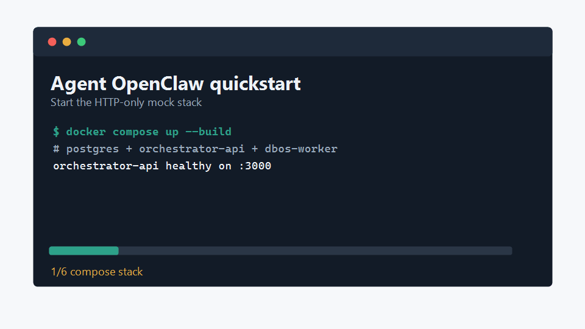

# Quickstart

This path starts Agent OpenClaw in HTTP-only mock mode. You do not need Feishu
credentials, OpenClaw provider keys, Rust, or Node on the host.



You need:

```text
Docker Desktop or Docker Engine with Docker Compose
```

## 1. Get The Repo

```bash
git clone <repo-url>
cd agent-openclaw
```

If you are working from a local checkout, just `cd` into the repo root.

## 2. Start The Stack

```powershell
docker compose up --build
```

Leave this terminal running. It starts:

```text
postgres
orchestrator-api  http://localhost:3000
dbos-worker
```

The default mode is:

```text
FEISHU_ADAPTER_ENABLED=false
FEISHU_DRY_RUN=true
OPENCLAW_AGENT_MODE=mock
```

## 3. Create A Job

Open a second terminal.

PowerShell:

```powershell
$body = @{
  prompt = 'Plan a short launch article for a new AI writing tool'
  requesterId = 'quickstart'
  routingMode = 'supervisor_pipeline'
} | ConvertTo-Json

$created = Invoke-RestMethod `
  -Uri 'http://localhost:3000/jobs' `
  -Method Post `
  -ContentType 'application/json' `
  -Body $body

$created
```

Bash/curl:

```bash
curl -s -X POST http://localhost:3000/jobs \
  -H 'content-type: application/json' \
  -d '{"prompt":"Plan a short launch article for a new AI writing tool","requesterId":"quickstart","routingMode":"supervisor_pipeline"}'
```

Ready-made examples for all four routing modes are in:

```text
examples/demo-jobs/
```

Expected shape:

```json
{
  "jobId": "JOB-...",
  "status": "queued",
  "ingressOrigin": "http"
}
```

## 4. Wait For The Result

PowerShell:

```powershell
do {
  Start-Sleep -Seconds 2
  $job = Invoke-RestMethod -Uri "http://localhost:3000/jobs/$($created.jobId)"
  $job.status
} until (@('succeeded', 'failed', 'waiting_for_human', 'cancelled') -contains $job.status)
```

Bash/curl:

```bash
JOB_ID='JOB-...' # replace with the jobId from step 3
while true; do
  STATUS=$(curl -s "http://localhost:3000/jobs/$JOB_ID" | sed -n 's/.*"status":"\([^"]*\)".*/\1/p')
  echo "$STATUS"
  case "$STATUS" in succeeded|failed|waiting_for_human|cancelled) break;; esac
  sleep 2
done
```

A successful first run should end at:

```text
succeeded
```

## 5. Inspect Outputs

PowerShell:

```powershell
Invoke-RestMethod -Uri "http://localhost:3000/jobs/$($created.jobId)/messages"
Invoke-RestMethod -Uri "http://localhost:3000/jobs/$($created.jobId)/timeline"
```

Bash/curl:

```bash
curl -s "http://localhost:3000/jobs/$JOB_ID/messages"
curl -s "http://localhost:3000/jobs/$JOB_ID/timeline"
```

`messages` is the user-visible conversation/output stream. `timeline` is the
debuggable execution record across job events, agent events, stage attempts,
reviews, artifacts, and group messages.

## 6. Stop Or Reset

Stop containers and keep local state:

```powershell
docker compose down
```

Delete local state too:

```powershell
docker compose down -v
```

## Routing Modes

Set `routingMode` in the `POST /jobs` body:

```text
supervisor_pipeline       safest default, stage review + retries
pipeline                  linear handoff, final quality gate
classic_master_slave      independent child outputs, optional final gate
master_slave_discussion   persisted discussion rounds, then synthesis
```

## Desktop Console

The browser version of the desktop console can talk to the same API:

```powershell
npm install --prefix apps/desktop-app
npm --prefix apps/desktop-app run dev
```

Open:

```text
http://localhost:5173
```

This optional path requires Node `^20.19.0 || >=22.12.0` and npm `>=10`.

## Troubleshooting

```text
docker compose cannot bind 3000:
  Another local API is running. Stop it or change the compose port mapping.

POST /jobs fails:
  Wait until orchestrator-api is healthy, then retry.

Job stays queued/running:
  Keep the compose terminal open and check orchestrator-api/dbos-worker logs.

You need real LLM/OpenClaw behavior:
  The quickstart intentionally uses OPENCLAW_AGENT_MODE=mock. Configure real
  OpenClaw mode after the HTTP-only path works.

You need Feishu:
  Feishu is optional. Start with HTTP-only, then read
  docs/reference-feishu-public-ingress.md for self-hosted public ingress.
```

## Verified Clean-Copy Result

This quickstart was last walked from a clean `git archive` copy on
2026-06-01:

```text
jobId=JOB-20260601-820940DC
terminalStatus=succeeded
ingressOrigin=http
messageCount=4
timelineItems=86
checked=git_archive_clean_copy,docker_compose_up_build,health,post_jobs,poll_terminal,get_messages,get_timeline
```

The demo GIF above was regenerated from a later repeatable Docker Compose smoke
on 2026-06-01:

```text
jobId=JOB-20260601-EF874902
terminalStatus=succeeded
ingressOrigin=http
messageCount=4
persistenceCheck=passed
checked=compose_up_build,http_create_job,poll_succeeded,get_messages,compose_restart_persistence
```
